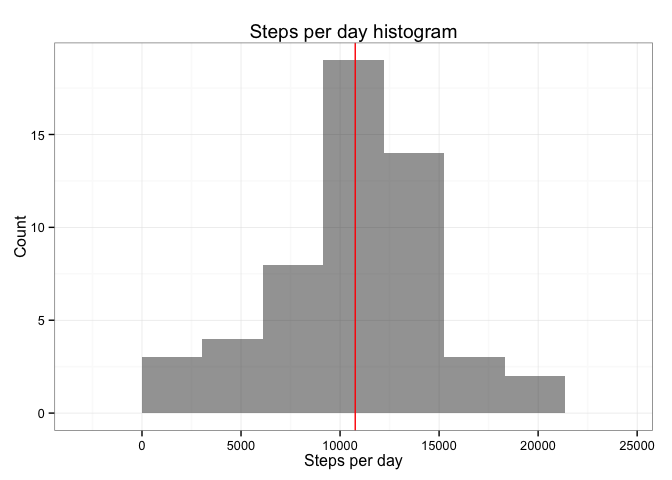
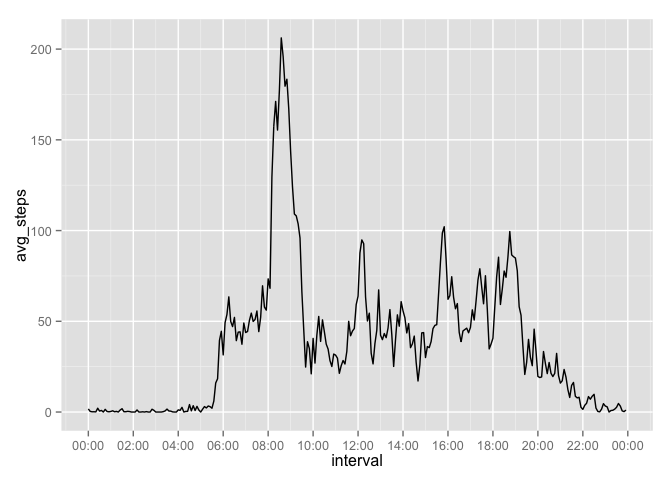
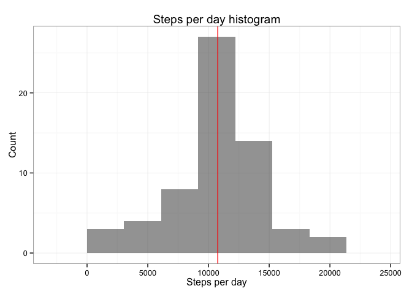

# Reproducible Research: Peer Assessment 1


## Loading and preprocessing the data


```r
# Loading  required libraries
library(dplyr)
library(lubridate)
library(ggplot2)
library(downloader)
library(scales)
```


```r
# Creating required project structure
wd_saved = getwd()

project_name = "RepData_PeerAssessment1"
project_dir = file.path(getwd(), project_name)

if (!file.exists(project_name)){
    dir.create(project_dir)
}

setwd(project_dir)

if (!file.exists("data")){
    dir.create("data")
}
```

```r
# Downloading and processing initial data
download("https://d396qusza40orc.cloudfront.net/repdata%2Fdata%2Factivity.zip", 
         "data/activity.zip", mode = "wb")
unzip("data/activity.zip", exdir = "data")
```

```r
steps_data <- read.table("./data/activity.csv", header = TRUE,
                       sep = ",", stringsAsFactors = FALSE)
steps_tbl <- tbl_df(steps_data)
steps_tbl <- mutate(steps_tbl, date = ymd(date))
```


## What is mean total number of steps taken per day?

```r
steps_per_day <- steps_tbl %>% group_by(date) %>% summarise(sum_steps = sum(steps))

n <- length(steps_per_day$sum_steps)
r <- diff(range(steps_per_day$sum_steps, na.rm = TRUE))
steps_hist <- ggplot(steps_per_day, aes(sum_steps))
steps_hist + geom_histogram(binwidth = r / (log2(n)+1), alpha = .5) + 
    theme_bw() + 
    labs(title = "Steps per day histogram", x = "Steps per day", y = "Count") + 
    geom_vline(xintercept = mean(steps_per_day$sum_steps, na.rm = TRUE), color = "red")
```

 
<p> Mean total number of steps taken per day can be found from the summary output: </p>

```r
summary(steps_per_day$sum_steps)
```

```
##    Min. 1st Qu.  Median    Mean 3rd Qu.    Max.    NA's 
##      41    8841   10760   10770   13290   21190       8
```


## What is the average daily activity pattern?

```r
activity_pattern <- steps_tbl %>% group_by(interval) %>% summarise(avg_steps = mean(steps, na.rm = TRUE))

activity_pattern <- mutate(activity_pattern, interval = parse_date_time(sprintf("%04d", interval), "%H%M"))

ggplot(activity_pattern, aes(interval, avg_steps)) + 
    geom_line() + 
    scale_x_datetime(breaks = "120 min", labels = date_format("%H:%M"))
```

 
<p>5-minute interval that, on average across all the days in the dataset, contains the maximum number of steps:</p>

```r
activity_pattern %>% filter(avg_steps == max(avg_steps))
```

```
## Source: local data frame [1 x 2]
## 
##              interval avg_steps
## 1 0000-01-01 08:35:00  206.1698
```
## Imputing missing values

<p> Total number and percentage of missing values in our data set: </p>

```r
sum(is.na(steps_tbl$steps))
```

```
## [1] 2304
```

```r
mean(is.na(steps_tbl$steps))
```

```
## [1] 0.1311475
```
Lets fill the NA positions with corrsponding values from activity_pattern:

```r
na_length = length(steps_tbl[is.na(steps_tbl$steps), ]$steps)

steps_tbl2 <- steps_tbl

steps_tbl2[is.na(steps_tbl2$steps), ]$steps <- rep(activity_pattern$avg_steps, length.out = na_length)
```

```r
steps_per_day2<- steps_tbl2 %>% group_by(date) %>% summarise(sum_steps = sum(steps))

n <- length(steps_per_day$sum_steps)
r <- diff(range(steps_per_day2$sum_steps))
steps_hist <- ggplot(steps_per_day2, aes(sum_steps))
steps_hist + geom_histogram(binwidth = r / (log2(n)+1), alpha = .5) + 
    theme_bw() + 
    labs(title = "Steps per day histogram", x = "Steps per day", y = "Count") + 
    geom_vline(xintercept = mean(steps_per_day2$sum_steps), color = "red")
```

 
<p> New mean total number of steps taken per day can be found from the summary output: </p>

```r
summary(steps_per_day2$sum_steps)
```

```
##    Min. 1st Qu.  Median    Mean 3rd Qu.    Max. 
##      41    9819   10770   10770   12810   21190
```
<p> As we can see, imputing missing values hasn't changed mean and median significantly.

## Are there differences in activity patterns between weekdays and weekends?


```r
setwd(wd_saved)
```
